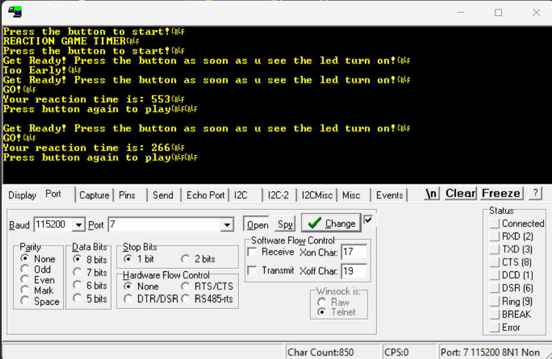

# STM32 Bare-Metal Reaction Timer Game

A modular **bare-metal STM32F446RE** project that measures human reaction time using a finite state machine, interrupt-driven timing, and debounced button input.

This project was developed completely at the **register level** without using the STM32 HAL, providing a deeper understanding of Cortex-M peripherals and embedded firmware architecture.

---

## Features

- Bare-metal STM32 programming (No HAL)
- Modular GPIO, UART, SysTick and Random drivers
- Interrupt-driven 1 ms system tick
- Finite State Machine (FSM) based game logic
- Software debounced push button
- Edge detection for reliable button events
- Pseudo-random delay generation
- Reaction time measurement with millisecond resolution
- UART output through RealTerm
- False-start ("Too Early!") detection
- Non-blocking READY state implementation

---

## Hardware

- STM32 Nucleo-F446RE
- On-board User LED (PA5)
- On-board User Button (PC13)
- ST-Link Virtual COM Port
- RealTerm Serial Terminal

---

## Software Architecture

```
main()
│
├── GPIO Driver
│     ├── LED Control
│     ├── Button Read
│     └── Debounced Button Events
│
├── UART Driver
│     ├── Write Character
│     ├── Write String
│     └── Write Unsigned Integer
│
├── SysTick Driver
│     ├── 1 ms Interrupt Tick
│     ├── Millisecond Timer
│     └── Delay Function
│
├── Random Driver
│     └── Linear Congruential Generator
│
└── Game Engine
      ├── WAIT
      ├── READY
      ├── GO
      └── RESULT
```

---

## Game State Machine

```
                Power On
                   │
                   ▼
              +---------+
              |  WAIT   |
              +---------+
                   │
             Button Press
                   │
                   ▼
              +---------+
              | READY   |
              +---------+
              │         │
      Early Press       │ Random Delay Elapsed
          │             │
          ▼             ▼
     "Too Early!"   +---------+
          │         |   GO    |
          └────────►+---------+
                         │
                  Button Press
                         │
                         ▼
                    +---------+
                    | RESULT  |
                    +---------+
                         │
                  Button Press
                         │
                         ▼
                        WAIT
```

---

## Project Structure

```
Core/
│
├── main.c
│
├── gpio_driver.c
├── gpio_driver.h
│
├── uart_driver.c
├── uart_driver.h
│
├── systick_driver.c
├── systick_driver.h
│
├── random.c
├── random.h
│
├── game.c
└── game.h
```

---

## Driver Overview

### GPIO Driver

- LED ON/OFF/Toggle
- Raw button reading
- Debounced button event detection
- Edge detection

### UART Driver

- Character transmission
- String transmission
- Unsigned integer printing
- Polling based communication

### SysTick Driver

- 1 ms interrupt generation
- Millisecond timer
- Software delay
- Interrupt-based timing

### Random Driver

Implements a Linear Congruential Generator (LCG):

```
X(n+1) = (1664525 × Xn + 1013904223)
```

Used to generate a random delay between **2–5 seconds**.

---

## Game Flow

1. User presses the button.
2. Game enters **READY** state.
3. Random delay (2–5 s) begins.
4. If the player presses early:

```
Too Early!
```

The game resets.

5. LED turns ON.
6. Timer starts.
7. Player presses the button.
8. Reaction time is calculated and displayed.
9. Player presses again to start another round.

---

## UART Output

```
REACTION GAME TIMER
Press the button to start!

Get Ready!

GO!

Your reaction time is: 413 ms

Press button again to play
```

---

## UART Output (RealTerm)

<p align="center">
  
</p>

---

## Embedded Concepts Demonstrated

### Peripheral Programming

- GPIO Registers
- USART Registers
- SysTick Timer
- RCC Clock Configuration

### ARM Cortex-M

- Interrupts
- SysTick Exception
- Volatile Variables
- Register-Level Programming

### Embedded Software Design

- Finite State Machines
- Driver Abstraction
- Layered Architecture
- Modular Design
- Event-Driven Programming
- Non-Blocking State Machine

### Button Handling

- Active-Low Inputs
- Edge Detection
- Software Debouncing

### Timing

- Interrupt-based Millisecond Timer
- Reaction Time Measurement
- Overflow-safe time calculations

---

## Future Improvements

- LCD/OLED display support
- Buzzer feedback
- High-score tracking
- EEPROM score storage
- Multiple difficulty levels
- Interrupt-based button handling
- RTOS implementation
- OLED reaction graph

---

## Learning Outcomes

This project strengthened my understanding of:

- Register-level STM32 programming
- ARM Cortex-M architecture
- Interrupt-driven firmware
- Finite State Machine design
- Embedded driver development
- Software debouncing
- Event-driven programming
- Modular embedded software architecture

---

## Author

**S Riddhi Reddy**

ECE Student | Embedded Systems | Bare-Metal Firmware | STM32